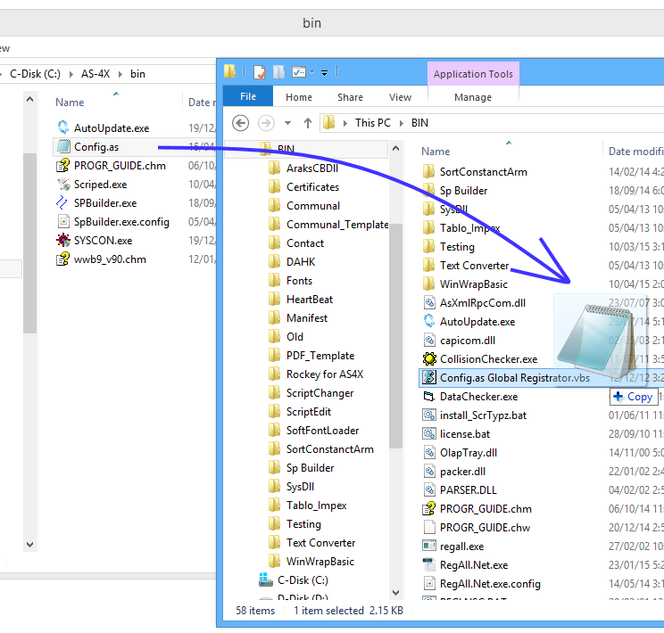
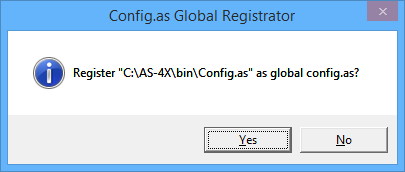

---
title: "Global Config.as"
author: "sts"
---

# Համընդհանուր կարգավորման ֆայլ 

Համընդհանուր կարգավորման ֆայլը դա գրանցված կարգավորման ֆայլ է, որը օգտագործվում է AS-4X հարթակի ծրագրերի կողմից, եթե նրանց կողքին չկա կարգավորման ֆայլ։

Որպեսզի կարգավորման ֆայլը գրանցվի որպես համընդհանուր, հարկավոր է `BIN` թղթապանակի մեջ գտնել `Config.as Global Registrator.vbs` ֆայլը և կարգավորման ֆայլը տանել նրա վրա։ 

Այնուհետև բացվում է երկխոսության պատուհան, որտեղ անհրաժեշտ է պատասխանել «Yes»։

Գրանցումը ավարտված է։

Հարկավոր է նշել, որ գրանցվում է միայն կարգավորման ֆայլի հասցեն, այլ ոչ թե պարունակությունը և հարկ չկա նորից գրանցել եթե ֆայլի մեջ կատարվում են փոփոխություններ։
