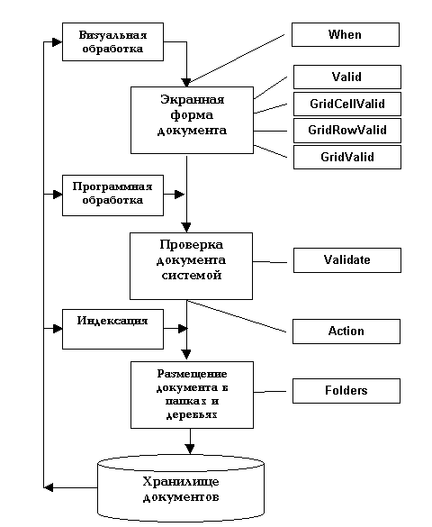

<html xmlns:v="urn:schemas-microsoft-com:vml" xmlns:o="urn:schemas-microsoft-com:office:office" xmlns="http://www.w3.org/TR/REC-html40">
<head>
<title>Последовательность системных событий для документа</title>

<link rel="File-List" href="Events_Sequence_files/filelist.xml">

<!--[if !mso]>

<![endif]--><!--[if gte mso 9]>
<xml><o:shapedefaults v:ext="edit" spidmax="1027"/>
</xml><![endif]-->
</head>

<body>

<!--[if gte vml 1]><v:line id="_x0000_s1025"
 style='position:absolute;left:0;text-align:left;top:0;flip:y;z-index:1'
 from="187.5pt,43.5pt" to="272.25pt,107.25pt"/><![endif]--><![if !vml]><![endif]>Последовательность 
системных событий для документа

<!--[if gte vml 1]><v:shapetype
 id="_x0000_t202" coordsize="21600,21600" o:spt="202" path="m,l,21600r21600,l21600,xe">
 <v:stroke joinstyle="miter"/>
 <v:path gradientshapeok="t" o:connecttype="rect"/>
</v:shapetype><v:shape id="_x0000_s1027" type="#_x0000_t202"
 href="IsHidden.html" style='position:absolute;left:276.75pt;top:36pt;width:90pt;
 height:18pt;z-index:1'>
 <v:textbox>
<table cellspacing="0" cellpadding="0" width="100%" height="100%">
	<tr>
		<td align="center"><b>IsHidden</b></td>
	</tr>
</table>
 </v:textbox>
</v:shape><![endif]--><![if !vml]><![endif]>&nbsp;&nbsp;&nbsp;&nbsp;&nbsp;&nbsp;&nbsp; <map name="FPMap0">
<area href="Folders.html" shape="rect" coords="321, 415, 456, 456">
<area href="Action.html" shape="rect" coords="322, 346, 454, 388">
<area href="Validate.html" shape="rect" coords="318, 270, 451, 309">
<area href="GridValid.html" shape="rect" coords="321, 161, 460, 193">
<area href="GridRowValid.html" shape="rect" coords="321, 133, 464, 158">
<area href="GridCellValid.html" shape="rect" coords="318, 102, 465, 129">
<area href="Valid.html" shape="rect" coords="318, 67, 463, 101">
<area href="When.html" shape="rect" coords="317, 14, 458, 59"></map><!--[if gte vml 1]><v:shape
 id="_x0000_s1028" type="#_x0000_t202" href="BeforeCommit.html" style='position:absolute;
 left:270pt;top:403.5pt;width:97.5pt;height:24pt;z-index:1'>
 <v:textbox>
<table cellspacing="0" cellpadding="0" width="100%" height="100%" id="table1">
	<tr>
		<td align="center">BeforeCommit</td>
	</tr>
</table>
 </v:textbox>
</v:shape><![endif]--><![if !vml]><![endif]><!--[if gte vml 1]><v:line
 id="_x0000_s1029" style='position:absolute;left:0;text-align:left;top:0;
 z-index:1' from="190.5pt,405pt" to="270pt,414.75pt"/><![endif]--><![if !vml]><![endif]>

&nbsp;

</body>
</html>
