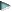

# GridValid համակարգային իրադարձություն

[Տես նաև](../scriptstproced.md) [Օրինակ](../Examples/E_GridValid.md) [Կիրառվում է](../Defs/doc.md)

Ակտիվանում է փաստաթղթի մեջ աղյուսակից դուրս բերելու/գալու ժամանակ։ Կիրառվում է ինչ-որ պայմանին համապատասխանող մոտքագրված արժեքները ստուգելու համար։ Համակարգային իրադարձությունների գեներացման հաջորդականությունը բերված է այստեղ՝ [](Events_Sequence.html։

Активизируется при попытке выхода из грид-таблицы в документе. Служит для проверки введенных значений на соответствие некоторому условию. <br>
Последовательность генерации системных событий приведена здесь [](Events_Sequence.html).


## Շարահյուսություն

```as4x
Sub GridValid(ByVal GridObj)
   Select Case GridObj.Name
      Case Grid1
          statements1
       Case Grid2
          statements2
         . . . . .
      Case GridN
          statementsN
    End Select     
End Sub
```

Բաղադրիչներն են՝

| Պարամետր | Նկարագրություն |
|--|--|
| GridN | Փաստաթղթի աղյուսակի ներքին անուն։ строковое выражение, определяющее идентификатор грида в документе. |


## Նկատառումներ

Ընդհանուր առմամբ մեկ փաստաթղթի մեկ կարող են լինել մի քանի աղյուսակներ, ինչի համար `GridValid` իրադարձության մշակիչի մեջ, կախված [փաստաթղթի  նկարագրությունից](../Defs/doc.md), հարկավոր է ստեղծել ընտրության հնարավորություն/պայման։

В общем случае в одном документе могут быть несколько грид-таблиц. Для этого в обработчике события <strong>GridValid</strong> удобно организовать условие выбора в зависимости от [идентификатора грид-таблицы](../Defs/doc.md).<br>
Идентификатор грида передается с верхнем регистре (UCASE).


