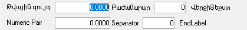

# NumPair( ) տվյալի տիպ

Թվային զույգ տվյալների տիպ։ Այն կազմված է երկու թվից, նրանց բաժանող բառից և վերջում գրվող բառից։


Այս տիպը կարող է օգտագործվել [փաստաթղթի դաշտերի նկարագրության](../Defs/doc.html) և [տվյալների աղբյուրի սյունակների](../Defs/Data.html) մեջ։  [Փաստաթղթի աղյուսակի սյունակների](../Defs/doc.html) տիպերի մեջ այն չի կարող օգտագործվել։ 

Տիպի մեջ սահմանափակված է զրոյական արժեքների մուտքագրումը,բայց կարող է կարգավորվել [ZeroNumber1](../Functions/ASDOC/Control.html#ZeroNumber1), [ZeroNumber2](../Functions/ASDOC/Control.html#ZeroNumber2) ֆունկցիաների միջոցով։ 


## Օրինակ

Փաստաթղթում ավելացված այսպիսի դաշտը

``` as4x
rekvizit { name=PAIR;
    caption="Թվային զույգ"; 
    ecaption="Numeric Pair"; 
    type="NumPair(NP(11,4),NP(5,0),Բաժանարար,Վերջի Տեքստ,Separator,End Label)"; }; 
```

Կունենա հետևյալ տեսքը (համակարգի հայերեն լեզվի դեպքում առաջին տողը, անգլերենի դեպքում երկրորդ տողը)։




## Շարահյուսություն

``` 
NumPair(Type1, Type2, [Separator], [Label], [ESeparator], [ELabel])
```

Բաղադրիչներն են՝

| Պարամետր | Նկարագրություն |
|--|--|
| Type1 | Առաջին արժեքը կարող է սահմանվել [NP()](Np.html) կամ [N()](N.html) թվային տիպի։ Այլ տիպեր օգտագործոլու դեպքում առաջանում է սխալ։ |
| Type2 | Երկրորդ արժեքը կարող է սահմանվել [NP()](Np.html) կամ [N()](N.html) թվային տիպի։ Այլ տիպեր օգտագործոլու դեպքում առաջանում է սխալ։ |
| Separator | Երկու արժեքների բաժանարար տեքստը։ Չփոխանցելու դեպքում կիրառվում է `/` նշանը։ |
| Label | Դաշտից հետո գրվող տեքստը (մեկ բառ)։ Որի երկարությունը կարող է լինել մինչև 10 նիշ։ Չփոխանցելու դեպքում ոչինչ չի գրվում։ |
| ESeparator | Երկու արժեքների բաժանարար տեքստը օտար լեզվով։ Չփոխանցելու դեպքում ընդունում է հայերենի համապատասխան արժեքը։ |
| ELabel |  Դաշտերից հետո գրվող տեքստը օտար լեզվով (մեկ բառ)։ Որի երկարությունը կարող է լինել մինչև 10 նիշ։ Չփոխանցելու դեպքում ընդունում է հայերենի համապատասխան արժեքը։ |


[См. также](../types.html)